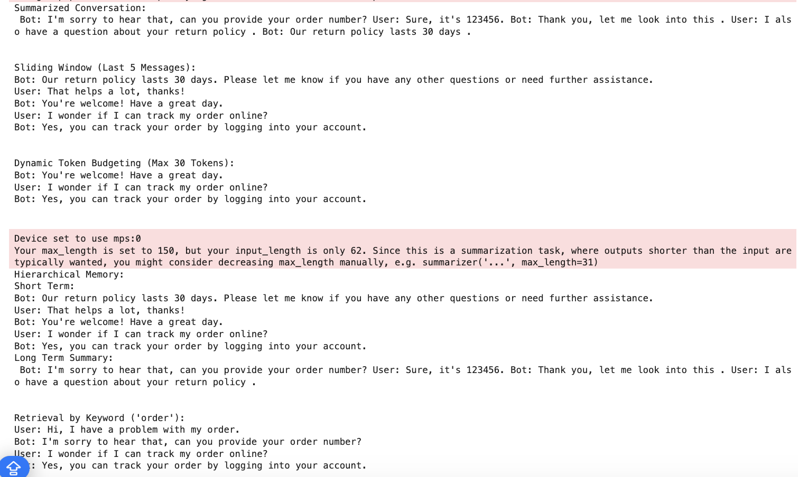
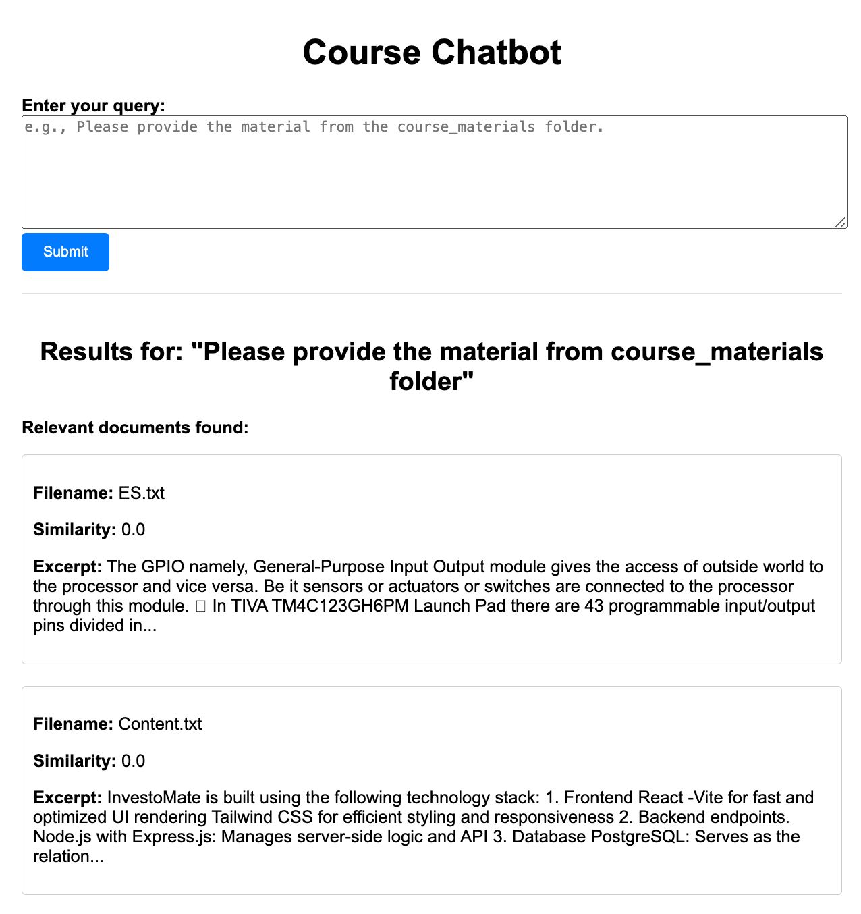

# Generative AI Course Assignments Report

**Course:** Generative AI  
**Student:** [Your Name]  
**Date:** [Submission Date]

## Overview

This repository contains two projects:
- **Qn1:** Strategies for managing context and reducing noise in conversational AI.
- **Qn2:** A conversational chatbot for retrieving relevant information from course materials.

---

## Qn1: Context Management

### Objective
Keep conversation responses coherent by summarizing history and reducing unnecessary noise.

### Key Approaches
- **Summarization:** Compress all or part of the chat history.
- **Sliding Window:** Retain only the most recent messages.
- **Dynamic Token Budgeting & Hierarchical Memory:** Prioritize key content within token limits.

### Outcome
Improved context retention, reduced processing overhead, and enhanced response relevance.

### Learnings
- Balancing context depth with efficiency is crucial.
- Combining summarization with a sliding window can maintain meaning while cutting noise.

---


## Qn2: Chatbot for Course Material Retrieval

### Objective
Develop a chatbot that quickly retrieves and displays course content based on user queries.

### Approach
- **Data Preparation:** Load `.txt` files from the `course_materials` folder.
- **Indexing & Retrieval:** Use TF-IDF vectorization and cosine similarity for document matching.
- **Integration:** Build a Flask web interface (see `Qn2.py`) that merges conversation history with retrieved content.

### Outcome
A functional chatbot that delivers accurate, context-aware responses using course materials.

### Learnings
- Efficient text indexing improves the relevance of responses.
- Merging dynamic conversation history with static indexed data can bridge information gaps.

---

## Reflections

- **Integration Matters:**  
  Combining real-time context with indexed documents is key to enhancing AI responses.
- **Trade-offs:**  
  Over-summarization might omit crucial details, while under-summarization may overwhelm the model. Fine-tuning the balance is essential.
- **Future Improvements:**  
  Future iterations could leverage more advanced retrieval algorithms (e.g., vector-based searches) and richer context features.

---

## How to Run

### Qn1:
- Open `Qn1.ipynb` in Jupyter Notebook to explore context management experiments.

### Qn2:
- Ensure course materials are in the `./course_materials` directory.
- Start the Flask app:
  ```bash
  python Qn2.py
